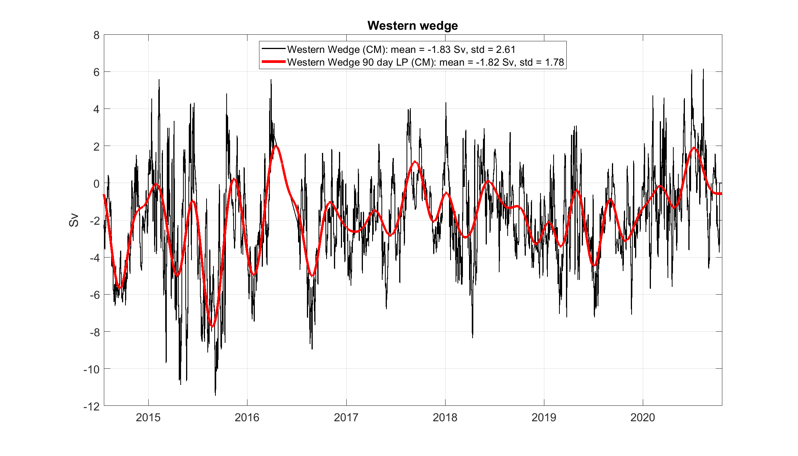
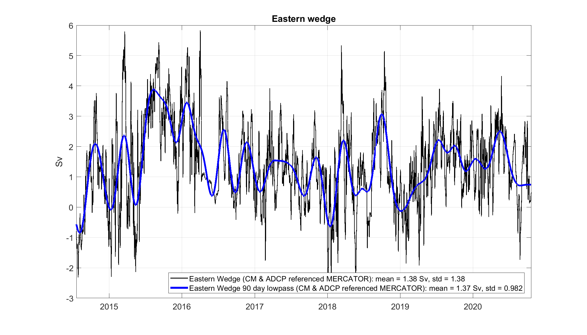
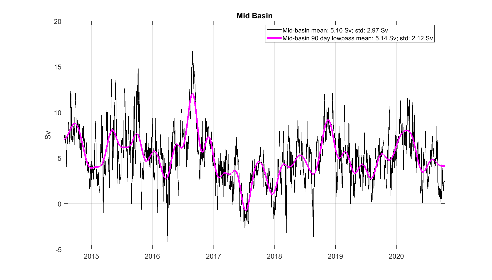
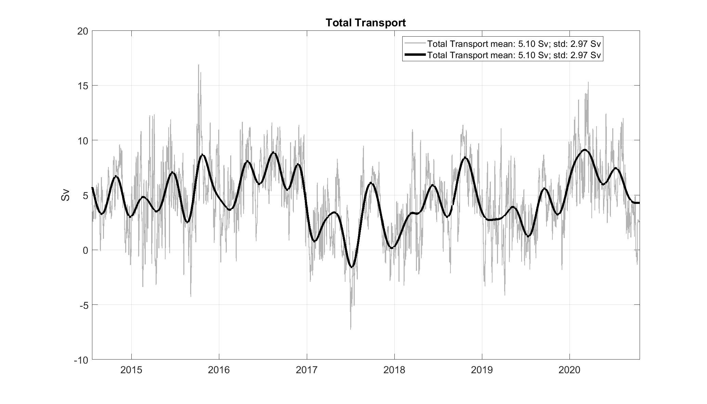

# The Rockall Trough Mooring Data – NERC National Capability Programme: Climate Linked Atlantic Sector Science

The Rockall Trough mooring array consists of five moorings with the following objectives: Rockall Trough Western Boundary 1 (RTWB1) & Rockall Trough Eastern Boundary 1 (RTEB1) are end-point density moorings measuring the baroclinic circulation across the width of the Rockall Trough using CTDs distributed in the vertical; RTWB1 & RTWB2 measure the Wyville-Thomson Ridge overflow current along the Feni Ridge using current meters; RTEB1, RTADCP1 & RTADCP2 measure the Shelf Edge Current using current meters and 75khz long-ranger acoustic Doppler current profilers. RTWB1 and RTEB1 include bottom pressure recorders to determine the barotropic variability across the Rockall Trough. The Rockall Trough section is also surveyed by glider, up to 10 times per year, as the glider transits to and from the Hatton Bank at the beginning and end of the 4-monthly glider missions. 

# Data products

Data are availabe for direct download as nectCDF files on the SAMS [THREDDS](https://thredds.sams.ac.uk/thredds/catalog/catalog.html) server [here](https://thredds.sams.ac.uk/thredds/catalog/lewysd/catalog.html). The NetCDF Climate and Forecast (CF) Metadata Conventions [Version 1.8](https://cfconventions.org/Data/cf-conventions/cf-conventions-1.8/cf-conventions.pdf) are used to describe the data. 

## 1. Mooring data

Rockall-Trough-Mooring-Time-Series-2020.nc is composed of conservative temperature, absolute salinity, and velocity data from either the western or eastern boundary mapped on to a regular depth and time grid. Data from the eastern boundary (e.g. TG_EAST, SG_EAST) is from a single mooring array east of the Rockall Trough. The western boundary data (e.g. TG_WEST,SG_WEST) comes as a merged profile from two mooring arrays west of the Rockall trough for temperature and salinity, and individual moored profiles for the velocity data (e.g. U_WEST_1,U_WEST_2).

*Table 1. Variable names from T_S_gridded.nc*

|     Variable    |     Description                                                      |     Unit                             |
|-----------------|----------------------------------------------------------------------|--------------------------------------|
|     TIME        |     Time                                                             |     days since 1st   January 1950    |
|     PRES        |     Sea water pressure                                               |     Decibar                          |
|     TG_EAST     |     Sea water temperature at   eastern boundary                      |     o C                              |
|     TG_WEST     |     Sea water temperature at   western boundary                      |     o C                              |
|     SG_EAST     |     Sea water salinity at   eastern boundary                         |     g kg-1                           |
|     SG_WEST     |     Sea water salinity at western   boundary                         |     g kg-1                           |
|     U_WEST_1    |     current speed u-direction   at western boundary (0-1600 m)       |     cm s-1                           |
|     V_WEST_1    |     current speed v-direction   at western boundary (0-1600 m)       |     cm s-1                           |
|     W_WEST_1    |     current speed w-direction   at western boundary (0-1600 m)       |     cm s-1                           |
|     U_WEST_2    |     current speed u-direction   at western boundary (1000-1800 m)    |     cm s-1                           |
|     V_WEST_2    |     current speed v-direction   at western boundary (1000-1800 m)    |     cm s-1                           |
|     W_WEST_2    |     current speed w-direction   at western boundary (1000-1800 m)    |     cm s-1                           |
|     U_EAST      |     current speed u-direction   at eastern boundary                  |     cm s-1                           |
|     V_EAST      |     current speed v-direction   at eastern boundary                  |     cm s-1                           |
|     W_EAST      |     current speed w-direction   at eastern boundary                  |     cm s-1                           |

### Gridded Temperature, Salinity, and Pressure (Microcats)

The microcat data were made up of Conductivity, Temperature (° C), and Pressure (db) records, which were calibrated using seawater samples and in-situ CTD profiles and corrected for sensor drift. The instrument data was fitted on to a regular 2-hour time grid using linear interpolation. Conductivity data were converted first to Practical Salinity (PSU) then Absolute Salinity, SA (g kg-1). Temperature (° C) were converted to Conservative Temperature, CT (° C). Salinity data were de-spiked for each instrument by excluding data outside of a cut-off of deployment-median salinity ± 10 g kg-1. Remaining data were further de-spiked up to n(=5) times through a loop where the cut off is one standard deviation from the deployment median, calculated during each pass.  Contemporaneous temperature data to the spikes in salinity were also excluded. SA, CT, and P were then low-pass filtered with MATLABs zero-phase digital filtering function; filtfilt, using a Butterworth filter design, 6th order, with cut-off frequency of ½(days). Gaps in the filtered data of more than 10 days were populated with fill values. The resulting data were fitted to a regular 2-hour time grid using linear interpolation. SA, CT, and P from all deployments were concatenated and then fitted to a regular 12-hour horizontal time grid and 20 db vertical pressure grid using linear interpolation. Salinity data were de-spiked n(=5) times through a loop where the cut off was 3.5 standard deviations from the time-series median during each pass.  Contemporaneous temperatures were also excluded. Linear Interpolation across vertical pressure grid of data values since de-spiking.  

_Figure 1. Gridded and merged temperature, salinity, and density from the eastern boundary_

_Figure 2. Gridded and merged temperature, salinity, and density from the eastern boundary_

### Gridded Velocity data (Aquadopp current meters)

Velocity data (from Nortek current meters) were corrected for sound and magnetic deviation. The data were low-pass filtered with MATLABs zero-phase digital filtering function; filtfilt, using a Butterworth filter design, 6th order, with a cut off frequency of [fs/(1/fs*2)], where the fs is the median time between samples. The velocity data from each deployment were fitted to a regular (12 hr) horizontal time and 20 db vertical pressure grid by linear, piecewise cubic polynomial, and Modified Akima piecewise cubic Hermite interpolation. Missing data between the shallowest instrument and the surface were extrapolated in the same manner. The mean of the interpolation/extrapolation was taken. The mean interpolated/extrapolated velocity data from each deployment were concatenated and de-spiked n times where velocity values beyond 3.5 times the standard deviation of the deployment mean were excluded. Vertical differences between velocity values that exceed 10 m s-1 were also excluded. Missing data resulting from de-spiking were re-fitted to the 12-hour grid along each depth using linear interpolation.

_Figure 3. Gridded current in u direction from the eastern boundary_

_Figure 4. Gridded current in u direction from the eastern boundary_

_Figure 5. Gridded current in u direction from the western boundary_

_Figure 6. Gridded current in u direction from the westrern boundary_

_Figure 7. Gridded current in u direction from the western boundary_

_Figure 8. Gridded current in u direction from the westrern boundary_

## 2. Volume transport

Rockall-Trough-Transport-Time-Series-2020.nc 

|     Variable               |     Description                                                             |     Unit    |
|----------------------------|-----------------------------------------------------------------------------|-------------|
|     tran_moor_w            |     Western wedge   transport                                               |     Sv      |
|     tran_moor_e            |     Eastern wedge   transport                                               |     Sv      |
|     tran_moor_c            |     Mid-basin   transport                                                   |     Sv      |
|     tran_moor_total        |     Sum of   western, eastern, and mid-basin transport                      |     Sv      |
|     tran_moor_w_90d_lp     |     90 day low passed   Western wedge transport                             |     Sv      |
|     tran_moor_e_90d_lp     |     90 day low passed   Eastern wedge transport                             |     Sv      |
|     tran_moor_c_90d_lp     |     90 day low passed   mid-basin transport                                 |     Sv      |
|     tran_moor_total_90d    |     Sum of 90 day   low passed western, eastern, and mid-basin transport    |             |

_Figure 9. Voume transport in the western wedge_

_Figure 10. Voume transport in the eastern wedge_

_Figure 11. Voume transport in the western wedge_

_Figure 12. Voume transport in the eastern wedge_

## 3. Glider data

Coming soon!
