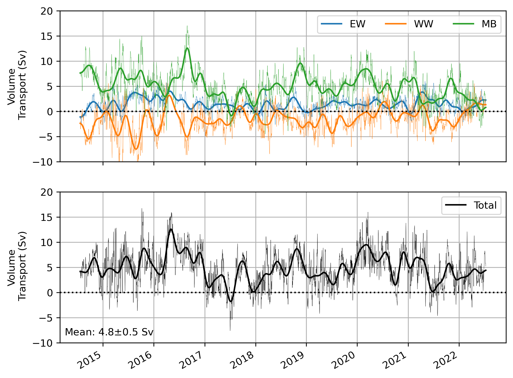
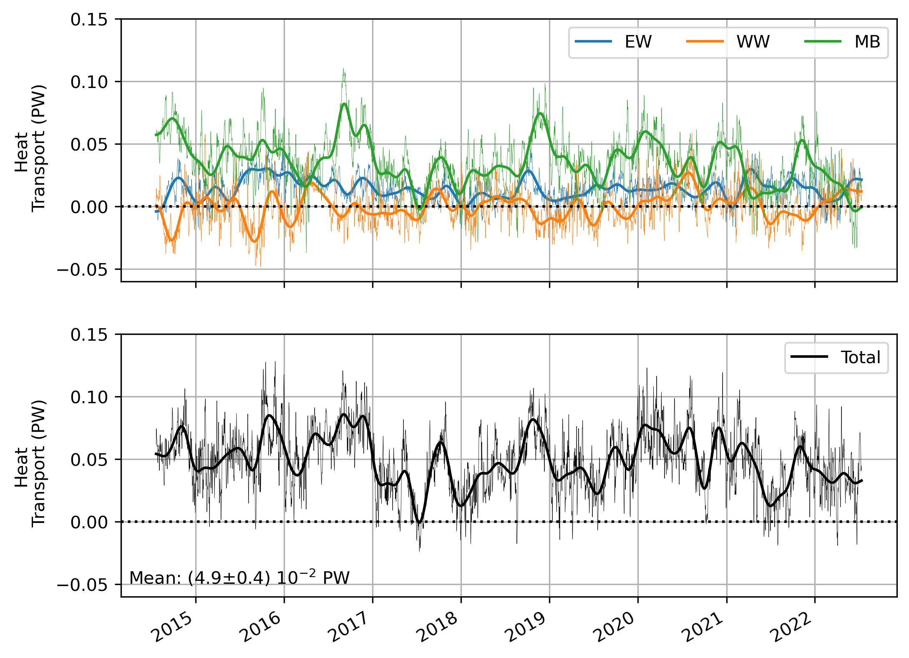
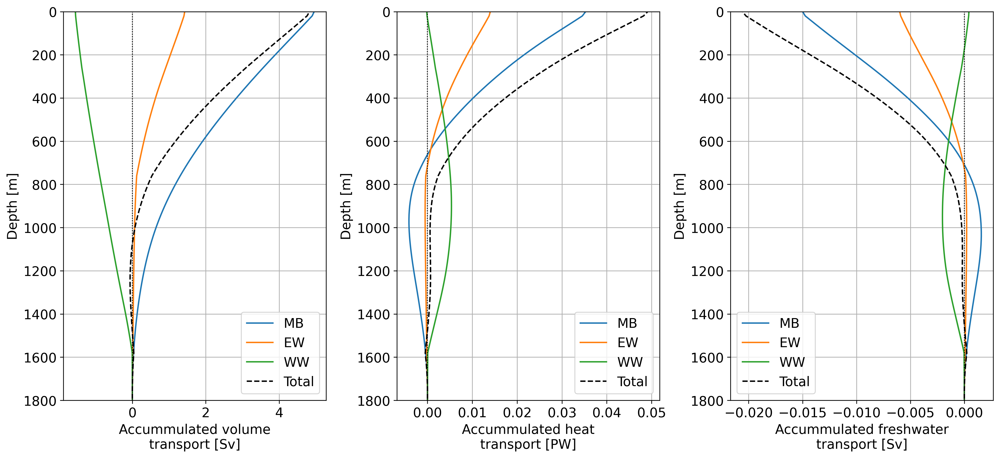

# The Rockall Trough Mooring Data – NERC National Capability Programme: Climate Linked Atlantic Sector Science

***The Rockall Trough mooring array consists of five moorings with the following objectives: Rockall Trough Western Boundary 1 (RTWB1) & Rockall Trough Eastern Boundary 1 (RTEB1) are end-point density moorings measuring the baroclinic circulation across the width of the Rockall Trough using CTDs distributed in the vertical; RTWB1 & RTWB2 measure the Wyville-Thomson Ridge overflow current along the Feni Ridge using current meters; RTEB1, RTADCP1 & RTADCP2 measure the Shelf Edge Current using current meters and 75khz long-ranger acoustic Doppler current profilers (Figure 1). RTWB1 and RTEB1 include bottom pressure recorders to determine the barotropic variability across the Rockall Trough. The Rockall Trough section is also surveyed by glider, up to 10 times per year, as the glider transits to and from the Hatton Bank at the beginning and end of the 4-monthly glider missions.***

_Figure 1. Figure taken from [Houpert et al., 2020](https://agupubs.onlinelibrary.wiley.com/doi/full/10.1029/2020JC016403). (a) Mean cross‐section velocity from the 16 (summer) Extended Ellett Line LADCP sections in the Rockall
Trough (1996–2017). Potential density anomalies (kg/m3) are shown as black contour lines. The design of the UK‐OSNAP mooring array deployed since 2014 in the Rockall Trough is superimposed. The different subregions used in the calculation of the volume flux are indicated on top. Acronym: CS, Continental Shelf. Panels (b) and (c) are the
pressure time series from the Rockall Trough WB and EB mooring instruments used in this study. Sea‐Bird SBE37 MicroCAT CTDs are indicated in red, Nortek Aquadopp current meters in blue, and reconstructed near‐surface instrument at EB1 from March to May 2017 in black (see section 2 for more details)._

## Table of Contents

  [1. Data access](#step1)
  
  [2. Mooring data](#step2)
  
   [2.1 Gridded Temperature, Salinity, and Pressure (Microcats)](#step21)
  
   [2.2 Gridded Velocity data (Aquadopp current meters)](#step22)
    
  [3. Volume transport](#step3)
  
  [4. Glider data](#step4)
  
  [5. References](#step5)

   [5.1 List of cruise reports](#step51)

   [5.2 List of published papers using these data](#step52)

## 1. Data access 

Data are availabe for direct download as nectCDF files from [SAMS data servers](https://thredds.sams.ac.uk/thredds/catalog/osnap/catalog.html).

NetCDF Climate and Forecast (CF) Metadata Conventions [Version 1.8](https://cfconventions.org/Data/cf-conventions/cf-conventions-1.8/cf-conventions.pdf) are used to describe the data.

## 2. Mooring data 

Rockall-Trough-Mooring-Time-Series-2020.nc is composed of conservative temperature, absolute salinity, and velocity data from either the western or eastern boundary mapped on to a regular depth and time grid. Data from the eastern boundary (e.g. TG_EAST, SG_EAST) is from a single mooring array east of the Rockall Trough. The western boundary data (e.g. TG_WEST,SG_WEST) comes as a merged profile from two mooring arrays west of the Rockall trough for temperature and salinity, and individual moored profiles for the velocity data (e.g. U_WEST_1,U_WEST_2).

*Table 1. Variable names from T_S_gridded.nc*

|     Variable    |     Description                                                      |     Unit                             |
|-----------------|----------------------------------------------------------------------|--------------------------------------|
|     TIME        |     Time                                                             |     days since 1st   January 1950    |
|     PRES        |     Sea water pressure                                               |     Decibar                          |
|     TG_EAST     |     Sea water temperature at   eastern boundary                      |     o C                              |
|     TG_WEST     |     Sea water temperature at   western boundary                      |     o C                              |
|     SG_EAST     |     Sea water salinity at   eastern boundary                         |     g kg-1                           |
|     SG_WEST     |     Sea water salinity at western   boundary                         |     g kg-1                           |
|     U_WEST_1    |     current speed u-direction   at western boundary (0-1600 m)       |     cm s-1                           |
|     V_WEST_1    |     current speed v-direction   at western boundary (0-1600 m)       |     cm s-1                           |
|     W_WEST_1    |     current speed w-direction   at western boundary (0-1600 m)       |     cm s-1                           |
|     U_WEST_2    |     current speed u-direction   at western boundary (1000-1800 m)    |     cm s-1                           |
|     V_WEST_2    |     current speed v-direction   at western boundary (1000-1800 m)    |     cm s-1                           |
|     W_WEST_2    |     current speed w-direction   at western boundary (1000-1800 m)    |     cm s-1                           |
|     U_EAST      |     current speed u-direction   at eastern boundary                  |     cm s-1                           |
|     V_EAST      |     current speed v-direction   at eastern boundary                  |     cm s-1                           |
|     W_EAST      |     current speed w-direction   at eastern boundary                  |     cm s-1                           |

### 2.1 Gridded Temperature, Salinity, and Pressure (Microcats) 

The microcat data were made up of Conductivity, Temperature (° C), and Pressure (db) records, which were calibrated using seawater samples and in-situ CTD profiles and corrected for sensor drift. The instrument data was fitted on to a regular 2-hour time grid using linear interpolation. Conductivity data were converted first to Practical Salinity (PSU) then Absolute Salinity, SA (g kg-1). Temperature (° C) were converted to Conservative Temperature, CT (° C). Salinity data were de-spiked for each instrument by excluding data outside of a cut-off of deployment-median salinity ± 10 g kg-1. Remaining data were further de-spiked up to n(=5) times through a loop where the cut off is one standard deviation from the deployment median, calculated during each pass.  Contemporaneous temperature data to the spikes in salinity were also excluded. SA, CT, and P were then low-pass filtered with MATLABs zero-phase digital filtering function; filtfilt, using a Butterworth filter design, 6th order, with cut-off frequency of ½(days). Gaps in the filtered data of more than 10 days were populated with fill values. The resulting data were fitted to a regular 2-hour time grid using linear interpolation. SA, CT, and P from all deployments were concatenated and then fitted to a regular 12-hour horizontal time grid and 20 db vertical pressure grid using linear interpolation. Salinity data were de-spiked n(=5) times through a loop where the cut off was 3.5 standard deviations from the time-series median during each pass.  Contemporaneous temperatures were also excluded. Linear Interpolation across vertical pressure grid of data values since de-spiking.  

_Figure 2. Gridded and merged temperature, salinity, and density from the eastern boundary_

_Figure 3. Gridded and merged temperature, salinity, and density from the eastern boundary_

### 2.2 Gridded Velocity data (Aquadopp current meters) 

Velocity data (from Nortek current meters) were corrected for sound and magnetic deviation. The data were low-pass filtered with MATLABs zero-phase digital filtering function; filtfilt, using a Butterworth filter design, 6th order, with a cut off frequency of [fs/(1/fs*2)], where the fs is the median time between samples. 
The velocity data from each deployment were fitted to a regular (12 hr) horizontal time and 20 db vertical pressure grid by linear, piecewise cubic polynomial, and Modified Akima piecewise cubic Hermite interpolation. Missing data between the shallowest instrument and the surface were extrapolated in the same manner. 
The velocity data from each deployment were concatenated and de-spiked. Vertical differences between velocity values that exceed 10 m s-1 were excluded. Missing data resulting from de-spiking were re-fitted to the 12-hour grid along each depth using linear interpolation.

_Figure 4. Gridded current in u direction from the eastern boundary_

_Figure 5. Gridded current in u direction from the eastern boundary_

_Figure 6. Gridded current in u direction from the western boundary_

_Figure 7. Gridded current in u direction from the westrern boundary_

_Figure 8. Gridded current in u direction from the western boundary_

_Figure 9. Gridded current in u direction from the westrern boundary_

## 3. Volume transport 
The calculation of the Rockall Trough transport timeseries is decribed in Fraser et al. (2022, https://doi.org/10.1029/2022JC019291). 
Rockall-Trough-Transport-Time-Series-2020.nc is the 6 years timeseries published in Fraser et al. (2022).
Rockall-Trough-Transport-Time-Series-2022.nc extends the timeseries of Fraser et al. (2022) to 8 years.

|     Variable    |     Description                                        |     Unit    |
|-----------------|--------------------------------------------------------|-------------|
| Q_EW            | Transport for Eastern Wedge                            |     Sv      |
| Q_MB            | Transport for Mid-Basin                                |     Sv      |
| Q_WW            | Transport for Western Wedge                            |     Sv      |
| Q_tot           | Total volume transport                                 |     Sv      |
| Q_EW_lp         | Low-passed filtered volume transport for Eastern Wedge |     Sv      |
| Q_WW_lp         | Low-passed filtered volume transport for Western Wedge |     Sv      |
| Q_MB_lp         | Low-passed filtered volume transport for Mid-Basin     |     Sv      |
| Qh_tot_lp       | Low-passed filtered total volume transport             | Sv          |
| Qh_EW           | Heat transport Eastern Wedge                           | PW          |
| Qh_MB           | Heat transport Western Wedge                           | PW          |
| Qh_WW           | Heat transport Mid Basin                               | PW          |
| Qh_tot          | Total heat transport                                   | PW          |
| Qh_EW_lp        | Low passed filtered heat transport Eastern Wedge       | PW          |
| Qh_MB_lp        | Low passed filtered heat transport Western Wedge       | PW          |
| Qh_WW_lp        | Low passed filtered heat transport Mid Basin           | PW          |
| Qh_tot_lp       | Total Low passed filtered heat transport               | PW          |
| Qf_EW            | Freshwater transport for Eastern Wedge                 |     Sv      |
| Qf_MB            | Freshwater transport for Mid-Basin                                |     Sv      |
| Qf_WW            | Freshwater transport for Western Wedge                            |     Sv      |
| Qf_tot           | Total Freshwater transport                                 |     Sv      |
| Qf_EW_lp         | 90 days low-passed filtered Freshwater transport for Eastern Wedge |     Sv      |
| Qf_WW_lp         | 90 days low-passed filtered Freshwater transport for Western Wedge |     Sv      |
| Qf_MB_lp         | 90 days low-passed filtered Freshwater transport for Mid-Basin     |     Sv      |
| Qf_tot_lp       | 90 days low-passed filtered total Freshwater transport            | Sv          |

_Figure 3.1. Mean velocity, temperature and salinity sections recontructed from moored observations and model analysis and reanalysis from GLORYS12V1 for the western wedge (WW), the mid basin (MB) and the eastern wedge (EW) of the Rockall Trough. Red dots mark section endpoints, green triangles mark mooring positions, and the blue square marks the position of the ADCP which is simulated using GLORYS12V1 output. For more information see Fraser et al. (2022)_

_Figure 3.2. Extended Rockall Trough volume transport time series for the single sections (upper) and the sum of all three (lower)._

_Figure 3.3. Extended Rockall Trough heat transport time series for the single sections (upper) and the sum of all three (lower)._

_Figure 3.4. Extended Rockall Trough freshwater transport time series for the single sections (upper) and the sum of all three (lower)._

_Figure 3.5. Depth accumulated mean timeseries of volume (left), heat (middle) and freshwater transport (right) in the Rockall Trough temporal averaged between 2014 and 2022._

## 4. Glider data 

SAMS glider missions

| Project  | Mission                        | Start date | End date  | Days in water | Months in water | Dives    (down + up) | Approx. distance (km) | Glider name     | Glider S/N | Glider mission |
| -------- | ------------------------------ | ---------- | --------- | ------------- | --------------- | -------------------- | --------------------- | --------------- | ---------- | -------------- |
| EEL      | Extended Ellett Line #1        | 12-Oct-09  | 07-Mar-10 | 146           | 4.9             | 789                  | 3020                  | Talisker        | SG156      | 1              |
| EEL      | Extended Ellett Line #2        | 03-May-11  | 03-Sep-11 | 123           | 4.1             | 841                  | 2292                  | Talisker        | SG156      | 2              |
| EEL      | Extended Ellett Line #3        | 30-Apr-14  | 13-Jul-14 | 74            | 2.5             | 651                  | 1423                  | Bellatrix       | SG532      | 5              |
| OSNAP    | OSNAP #1                       | 16-Jul-14  | 02-Feb-15 | 201           | 6.7             | 1864                 | 3103                  | Jura            | SG604      | 1              |
| OSNAP    | OSNAP #2                       | 14-Oct-14  | 16-Apr-15 | 184           | 6.1             | 1597                 | 2987                  | Scapa           | SG602      | 1              |
| EEL      | Extended Ellett Line #4        | 06-Feb-15  | 18-Aug-15 | 193           | 6.4             | 1775                 | 3753                  | Ardbeg          | SG545      | 3              |
| OSNAP    | OSNAP #3                       | 06-Feb-15  | 24-Jun-15 | 138           | 4.6             | 958                  | 2607                  | Bowmore         | SG605      | 1              |
| OSNAP    | OSNAP #4                       | 08-Jun-15  | 01-Dec-15 | 176           | 5.9             | 886                  | 2911                  | Laphroaig       | SG603      | 2              |
| EEL      | Extended Ellett Line #5        | 11-Feb-16  | 29-May-16 | 108           | 3.6             | 758                  | 2062                  | Eltanin         | SG156      | 1              |
| OSNAP    | OSNAP #5                       | 11-Feb-16  | 05-Jul-16 | 145           | 4.8             | 996                  | 2298                  | Bowmore         | SG605      | 2              |
| OSNAP    | OSNAP #6                       | 23-Aug-16  | 09-Sep-16 | 17            | 0.6             | 427                  | 420                   | Ardbeg          | SG545      | 4              |
| OSNAP    | OSNAP #7                       | 01-Oct-16  | 10-Feb-17 | 132           | 4.4             | 1685                 | 2200                  | Growler         | u_408      | 1              |
| EEL      | Extended Ellett Line #6        | 10-Feb-17  | 26-May-17 | 105           | 3.5             | 770                  | 1674                  | Bowmore         | SG605      | 3              |
| OSNAP    | OSNAP #8                       | 10-Feb-17  | 04-Jul-17 | 144           | 4.8             | 1350                 | 2410                  | Scapa           | SG602      | 2              |
| OSNAP    | OSNAP #9                       | 21-May-17  | 14-Nov-17 | 177           | 5.9             | 1618                 | 2888                  | Bellatrix       | SG532      | 6              |
| OSNAP    | OSNAP #10                      | 14-Nov-17  | 30-Apr-18 | 167           | 5.6             | 1667                 | 2923                  | Jura            | SG604      | 2              |
| OSNAP    | OSNAP #11                      | 30-Apr-18  | 13-Oct-18 | 166           | 5.5             | 1149                 | 2209                  | Kate Stansfield | SG616      | 1              |
| COMPASS  | COMPASS #1                     | 13-Aug-18  | 19-Oct-18 | 67            | 2.2             | 2052                 | 735                   | Corryvreckan    | SG647      | 1              |
| EA       | Ellett Array #1                | 09-Jan-19  | 27-Jun-19 | 169           | 5.6             | 1674                 | 3074                  | Bellatrix       | SG532      | 7              |
| EA       | Ellett Array #2                | 27-Jun-19  | 20-Nov-19 | 146           | 4.9             | 1030                 | 1898                  | Denebola        | SG534      | 5              |
| EA       | Ellett Array #3                | 20-Mar-20  | 30-Aug-20 | 163           | 5.4             | 1491                 | 2544                  | Bellatrix       | SG532      | 8              |
| EA       | Ellett Array #4                | 24-Sep-20  | 27-Feb-21 | 156           | 5.2             | 1959                 | 2515                  | Bowmore         | SG605      | 5              |
| EA       | Ellett Array #5                | 03-Mar-21  | 06-Jun-21 | 95            | 3.2             | 1330                 | 1842                  | Bellatrix       | SG532      | 9              |
| EA       | Ellett Array #6                | 15-Oct-21  | 24-Mar-22 | 160           | 5.3             | 1978                 | 2942                  | Artemis         | SG671      | 1              |
| EA       | Ellett Array #7                | 24-Mar-22  | 29-Apr-22 | 36            | 1.2             | 459                  | 693                   | Bellatrix       | SG532      | 10             |
| C2       | C2 Ellett Array                | 02-Jun-22  | 26-Aug-22 | 85            | 2.8             | 1514                 | 1155                  | Omura           | SG637      | 5              |
| EA       | Ellett Array #8                | 01-Jul-22  | 03-Nov-22 | 125           | 4.2             | 2185                 | 2046                  | Artemis         | SG671      | 2              |
| EA       | Ellett Array #9                | 17-Nov-22  | 02-Mar-23 | 105           | 3.5             | 1126                 | 2127                  | Denebola        | SG534      | 6              |

_Figure 1. Hovmöller plot of Rockall Trough linked glider missions._

## 5. References 

### 5.1 List of cruise reports 

A full repository of cruise reports for the UK-ONSAP programme is available through [BODC](https://www.bodc.ac.uk/projects/data_management/uk/uk-osnap/cruise_programme/).

[Cunningham, Stuart & Houpert, Loïc. (2016). RSS Discovery DY053, 26 th June to 23 rd July 2016, King George V Dock, Glasgow to Reykjavick, Iceland. OSNAP Mooring Cruise Report.. 10.13140/RG.2.2.18377.54885.](https://www.bodc.ac.uk/resources/inventories/cruise_inventory/report/16033/)

[Holliday, N.P. and et al, (2016) RRS Discovery Cruise DY054, 27 Jul - 17 Aug 2016, Reykjavik to Southampton. OSNAP 2016 mooring refurbishment cruise, Leg 2 (National Oceanography Centre Cruise Report, 40) Southampton, GB. National Oceanography Centre 77pp.](https://eprints.soton.ac.uk/400736/)

### 5.2 List of published papers using these data 

A full list of OSNAP publications and reports can be found [here](https://www.ukosnap.org/results-and-publications). Publications and reports using these data are being updated below.

[Houpert, L., Inall, M. E., Dumont, E., Gary, S., Johnson, C., Porter, M., et al. (2018). Structure and transport of the north atlantic current in the Eastern Subpolar Gyre from sustained glider observations. Journal of Geophysical Research: Oceans, 123, 6019– 6038. https://doi.org/10.1029/2018JC014162](https://agupubs.onlinelibrary.wiley.com/doi/full/10.1029/2018JC014162)

Test edit
